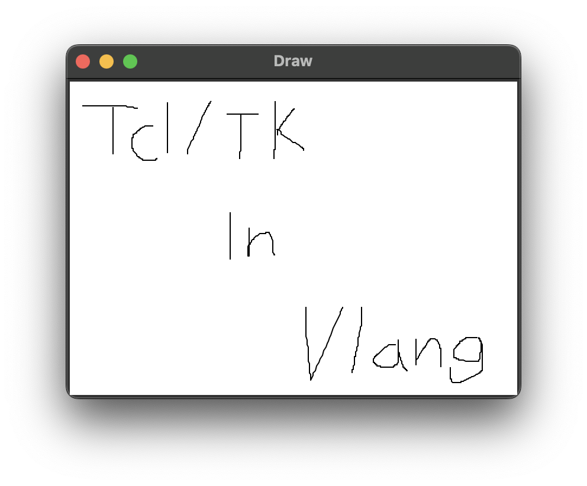

# tcl
Simple tcl/tk wrapper for vlang

> [!NOTE] This wrapper is not complete.

# FAQ
* When compile and run on MacOs, it might pop out a warning says `DEPRECATION WARNING: The system version of Tk is deprecated and may be removed in a future release. Please don't rely on it. Set TK_SILENCE_DEPRECATION=1 to suppress this warning.` - The solution is ignore it or use the Homebrew build of tcl/tk.
